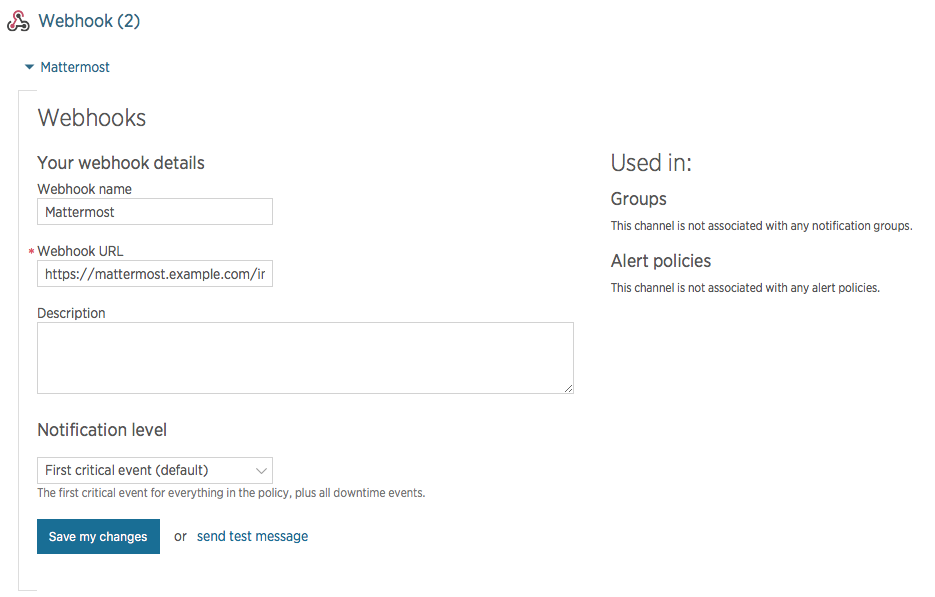

# Mattermost NewRelic integration

## Quick run down

This is a Go program, so the usual rules apply.

```bash
git clone github.com/lloeki/mattermost-newrelic-integration.git
```

Create a config.json file:

```json
{
    "listen": "127.0.0.1:8230",
    "username": "NewRelic",
    "icon_url": "https://some.where.ccom/icon.png",
    "tokens": [
        {
            "value": "fa66a9dc3904d0d450837de56205178a5bb751d8",
            "channel": "town-square",
            "webhook": "https://mattermost.example.com/hooks/6d7f0beaec7547d2f237c28f079d"
        },
        {
            "value": "80800493caba0202daf0aff1fd78324295a46c0d",
            "channel": "admin",
            "webhook": "https://mattermost.example.com/hooks/028802aba9c5f8acd2353fa148"

        }
    ]
}
```

Then run for a test with `go run main.go`, build with `go build`. A convenience
`test.sh` is provided, lend it a token value as first argument. The program can
take the path to a config file as first argument, and defaults to `config.json`
in the working directory.

## Configuration details

- `listen` is a listen string (see Go `ServeAndListen`), typically
  `127.0.0.1:8230` but the host part can be omitted to listen on all
  interfaces.
- You can have any number of `tokens`, dispatching to different channels
  and using different (or the same) webhooks.
- Replace `value` with whatever you want, for example output from `xxd -l 20 -p /dev/random`.
- `webhook` is the Mattermost webhook URL to relay to.
- `channel` is optional and will default to the value in the webhook on the
  Mattermost side.

## SSL via Matterfront's NGiNX reverse proxy

You probably don't want stuff to be snoopable, so you can reuse your Mattermost
NGiNX config which should have SSL.

Add this to your mattermost nginx config before the `location /` block:

    location ~ ^/integrations/newrelic {
        rewrite ^/integrations/newrelic/(.*)$ /$1 break;

        gzip off;
        proxy_set_header X-Forwarded-Ssl on;
        client_max_body_size 50M;
        proxy_set_header Upgrade $http_upgrade;
        proxy_set_header Connection "upgrade";
        proxy_set_header Host $http_host;
        proxy_set_header X-Real-IP $remote_addr;
        proxy_set_header X-Forwarded-For $proxy_add_x_forwarded_for;
        proxy_set_header X-Forwarded-Proto $scheme;
        proxy_set_header X-Frame-Options   SAMEORIGIN;
        proxy_pass http://localhost:8230;
    }

## Start, restart and log with systemd

Here's a systemd unit that will handle stdout/stderr log capture and restart on
failure. Save it to `/etc/systemd/system/mattermost-newrelic-integration.service`:

    [Unit]
    Description=Mattermost NewRelic integration
    After=network.target

    [Service]
    User=mattermost
    ExecStart=/home/mattermost/mattermost-newrelic-integration/bin/mattermost-newrelic-integration
    WorkingDirectory=/home/mattermost/mattermost-newrelic-integration
    Restart=always
    RestartSec=30

    [Install]
    WantedBy=multi-user.target

## Setup on the NewRelic side

On NewRelic, create a new outgoing webhook and fill in the following fields:

- Webhook name: Mattermost
- Webhook URL: https://mattermost.example.com/integrations/newrelic/webhook/replacewithyourtoken
- Description: whatever

Here's a screenshot of the page at the time of writing:


